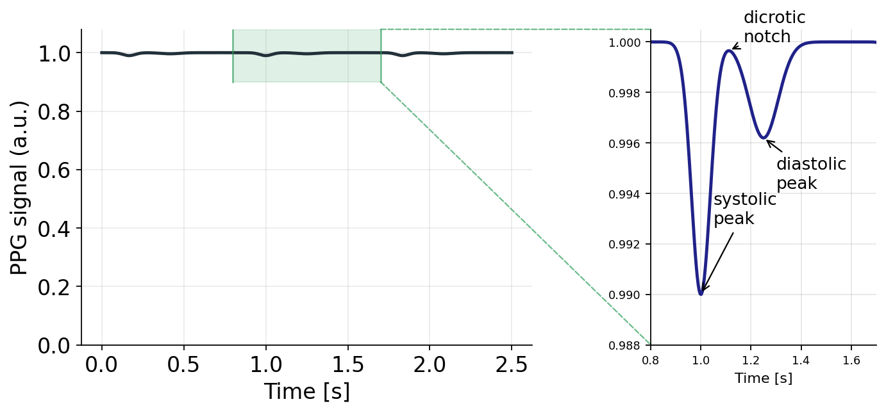
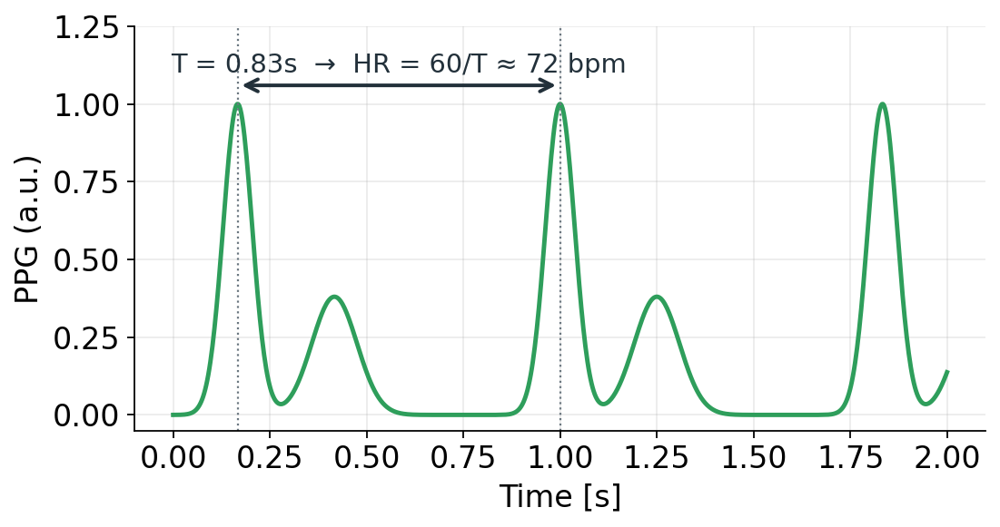
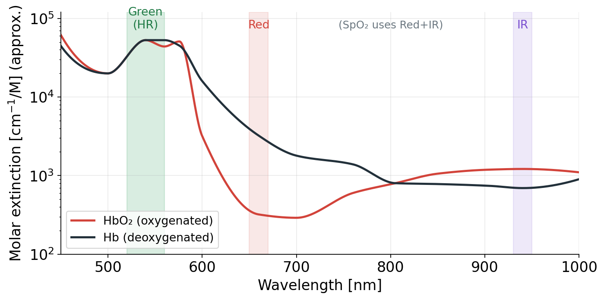
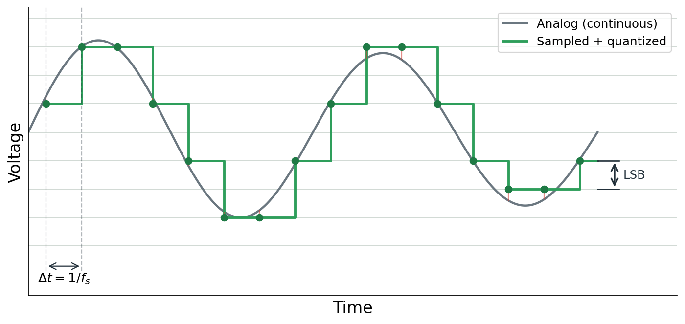
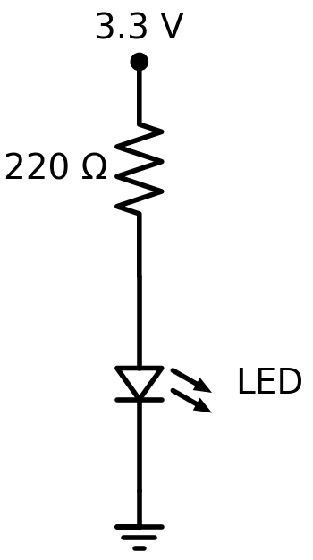
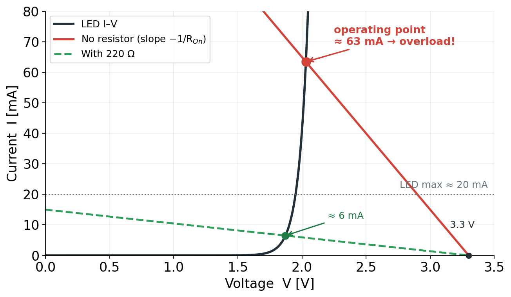
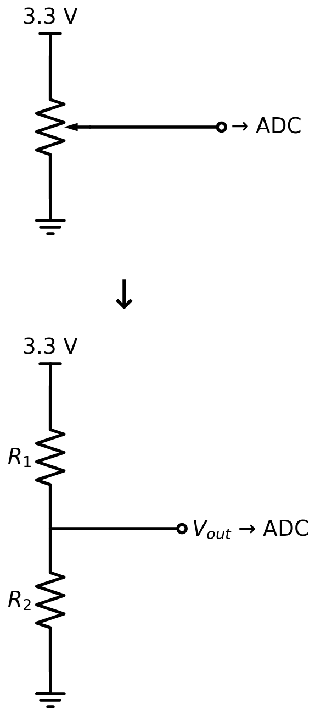

<!-- _class: lead -->
<!-- _paginate: false -->

# 複雑理工学実験概論

## 生体計測グループ (篠田・牧野) 第1回

担当: 特任助教 鈴木 颯

---

<!-- _class: lead -->

## この授業のねらい

「工学的なものの考え方」を体験する

題材は **PPG (光電容積脈波)による脈拍計測**

生体の「微弱でノイズまみれの信号」から, どうやって信号を抽出するか

---

<!-- _class: lead -->

## 1

# スマートウォッチの背面はなぜ緑に光ってる？

---

## PPG = 光電容積脈波

**Photoplethysmography**: 光で「血液の量の変化」を測る手法

1. LED で皮膚に光を当てる
2. 血液 (ヘモグロビン)が特定波長の光を **吸収** する
3. 心拍で動脈の血液量が **脈動** → **受光量が変動**
  - 血液量が多い時 → 吸収が増える → 受光量が減る
4. 受光素子 (フォトダイオード等)で光を電気信号に変えて読み取る

---

## 反射型 と 透過型

<div class="cols">
<div>

- **透過型 (transmissive)**
  組織を挟んで反対側で受ける
  → **病院のパルスオキシメータ** (指クリップ)

- **反射型 (reflective)**
  LEDと受光素子が同じ面. 皮膚で散乱・反射した光を見る
  → **スマートウォッチ** (手首は挟めない)

</div>
<div>


</div>
</div>

透過型のほうが内部の情報が多いので精度が高い, が装着できる部位が限られている

---

## 脈は「巨大なDC」に埋もれた「微小なAC」

<div class="cols">
<div>



</div>
<div>

- 1つ目のピーク (systolic peak) は心臓の収縮で血液が動脈に流れ込むときのピーク
- 2つ目のピーク (diastolic peak) は血液が末梢や分岐点で反射して戻ってくるときのピーク

</div>
</div>

- 受光量 = 大きな **DC成分** (組織・静脈などの一定吸収)＋ 小さな **AC成分** (動脈の拍動)
- AC は DC の **約1%程度** ─ 「この小波をどう取り出すか」が第2回で扱う主な課題

---

## 脈波から心拍数を読む



- 波形のピーク＝1拍 (収縮期)
- (第一) ピーク間隔 $T$ から
  $$ \text{HR} = \frac{60}{T}\ \text{[bpm]} $$

---

## なぜ緑？ なぜ赤＋赤外？



- **緑(～530nm): 心拍計**
  Hb/HbO₂ ともよく吸収 → 拍動信号が大きく **SNRが高い**
- **赤(660)＋赤外(940): 血中酸素 SpO₂**
  赤では Hb > HbO₂, 赤外では逆転 → **2波長の比** から酸素飽和度を算出

---

## 実際の計測に乗るノイズ

ACはDCの約1%. 実際の計測では以下のノイズが重なる:

- **環境光** ─ 太陽・蛍光灯が受光素子に直接入る
- **体動アーティファクト** ─ 指や手首の動きで光路が変動する
- **個人差** ─ 皮膚の色・厚み・装着圧で信号強度が変わる

> 第1回はシミュレータで理想的な信号を扱う
> 第2回では実機でノイズへの対処を扱う

---

<!-- _class: lead -->

## 2

# マイコン入門

---

## マイコン？

マイコン = マイクロコントローラ (μC, Micro Controller Unit/MCU)

簡単に言えば小さなCPU + 周辺機器 (ペリフェラル) が1チップに入ったコンピュータ

ペリフェラルの例: 
  - GPIO (General Purpose I/O) ─ デジタルのON/OFFを扱う
  - ADC (Analog to Digital Converter) ─ アナログ電圧を数値
  - タイマ, PWM (Pulse Width Modulation)
  - I$^2$C/SPI/UARTなどの通信機能

消費電力やサイズの制約があるシステムはMCUを使うのが鉄板
そのため, ほとんどのセンサはアナログ出力するか, I$^2$C/SPIでデータをデジタル通信する

---

## Raspberry Pi Pico

- 数百円. 学習にも実用にも使われる定番マイコン
- **MicroPython** でプログラミング可能
- **ADC内蔵** (12bit)・GPIO・I$^2$C対応
- **Wokwi でシミュレート可能** ← 今日はこれを使う

このほか, Arduino, ESP32, STM32などもよく使われるマイコン(ボード)
今回くらいの内容なら正直どれでもOK

---

## システムの全体像


- フォトダイオード ─ 光を電流に
- ADC ─ 電圧を数値に (A/D変換)
- マイコン ─ 数値を処理 (フィルタ等)
- 出力 ─ 表示・通信

---

## GPIO と ADC

- **GPIO** (General Purpose I/O)
  デジタルの **ON/OFF** (0V or 3.3V)
  例: LEDを光らせる, ボタンを読む

- **ADC** (Analog-to-Digital Converter)
  連続的な **アナログ電圧** を **数値** に変換
  例: センサの 0-3.3V を 0-4095 の整数 (12bit) に

> LEDはOn/Offでいい → GPIO
> 脈波センサの出力は連続的に変化する電圧 → ADC

ちなみに, DACが乗ってるマイコンは少ない. そういう場合はPWMで代用することができる

---

## アナログ → デジタル: 標本化と量子化

<div class="cols">
<div>

- **標本化 (sampling)**: 一定間隔 $\Delta t = 1/f_s$ で値を取る (時間の離散化)
  - Picoは$f_s=500$ kHz (Max)
  - サンプリング定理から, サンプリング周波数は信号の2倍より高い必要がある
- **量子化 (quantization)**: とびとびの段に丸める (振幅の離散化)
  - Picoの分解能は**12bit**
  $$ \text{LSB} = \frac{3.3\,\text{V}}{4096} \approx 0.81\,\text{mV} $$

</div>
<div>



</div>
</div>

> 脈拍はたかだか数Hzの低周波信号 → 500kHzは十分
> 分解能は...?

---

<!-- _class: lead -->

## 3

# ハンズオン①: Lチカと回路の基本

---

## Wokwi を開く

- ブラウザで動く **回路＋マイコンのシミュレータ** (インストール不要)
- [Pico + MicroPython のテンプレート](https://wokwi.com/projects/new/micropython-pi-pico)を開く

**やってみよう**
1. [上記のテンプレート](https://wokwi.com/projects/new/micropython-pi-pico)を開く
2. 左にコード `main.py`, 右に回路がある画面を確認
3. 右側の➕️ボタンから**LED**を置き, 適当なGPIOピンとGNDに配線
    - Anode が+側 (GPIO), Cathodeが-側 (GND)
4. コードを書いて ▶ で実行

---

## MicroPython で Lチカ

```python
from machine import Pin
import time

led = Pin(13, Pin.OUT) # 13番ピン以外でもOK
...
```

`led.on()` で点灯, `led.off()` で消灯, `led.toggle()` で状態を反転

## 1秒ごとに点滅させるコードを書いてみよう 

---

## 「電流制限抵抗」



このままでもLEDは光るが, 過電流で壊れる可能性がある → **抵抗**を入れて電流を制限する.

オームの法則 $V = IR$ より, 赤色LED (順電圧 $V_f \approx 2.0$V)を 3.3V で光らせると:
$$ I = \frac{V_{cc}-V_f}{R} \approx \frac{3.3-2.0}{220} = 5.9\,\text{mA} $$

> 抵抗値を変えると電流＝明るさが変わる
> 定格電流はLEDのスペックを確認 (一般的には20mA程度)

---

## 抵抗入れなかったら実際何が起こる?



- 実際はGPIO出力ピンの内部にオン抵抗があるので, 直接LEDを繋いでも3.3VがそのままLEDにかかることはない
- ただし, LEDが過電流で壊れる可能性はあるし, ピンの異常発熱でMCUが壊れる可能性がある

→ 実機では抵抗は必ずいれること

---

<!-- _class: lead -->

## 4

# ハンズオン②: センサを読む

---

## 可変抵抗を「脈波センサ」に見立てる



- 本物のフォトダイオードは「光量に応じて電流が変わる」
- まずは **可変抵抗 (ポテンショメータ)** で代用
  つまみ＝光の変化 と考える
- 3.3V と GND の間につなぎ, 中点を **ADCピン** へ
- つまみを動かす → ADCで読む値が変わる

**やってみよう**
1. 可変抵抗 (potentiometer) を配置する
1. 可変抵抗とMCUを結線
    1. VCCは電源
    1. SIGが出力 → ADCピン (GP26-28のいずれか)

---

## ADC で読んで print する

```python
from machine import ADC, Pin

sensor = ADC(Pin(26)) # ADCに使えるのは26,27,28ピンのいずれかのみ
...
```

`sensor.read_u16()` で 0-65535 の整数が返る (12bit ADCを16bitに引き伸ばしている)

## 一定間隔でセンサ値を読み取ってシリアルに出力するコードを書いてみよう

---

<!-- _class: lead -->

## 5

# まとめと次回予告

---

## まとめ

- PPGは光で血液量の変化を測る手法
- 脈波は大きなDC成分に埋もれた微小なAC成分 → これをどう取り出すかが課題
- マイコンは小さなコンピュータ. GPIOやADCなどのペリフェラルを使ってセンサを読み取る
- シミュレータで **読む・処理する** の最小形を体験

**次回 (対面)**
- 実機の Pico を使って, LED＋フォトトランジスタで脈波計測
- ノイズへの対処 → 専用ICの活用

---

## 次回の準備

- 受講者を2つのグループに分けて, それぞれ別日で実施します
  - グループは後ほどUTOLにて掲載します
  - 自分の番じゃない週はお休みです
  - 機材の数の関係で1グループあたり14人までになります. その範囲であれば調整が可能なので, もしご都合が悪い場合はご連絡ください
    - 連絡先: `suzuki@hapis.k.u-tokyo.ac.jp`

- 必要なもの
  - Laptop PC (Windows/Mac/Linux いずれも可)
  - 最新のブラウザ (Chrome/Edge/Firefox等, **Safariは不可** )
  - USBケーブル (Type-C or Micro-Bのデバイスに接続できるもの)