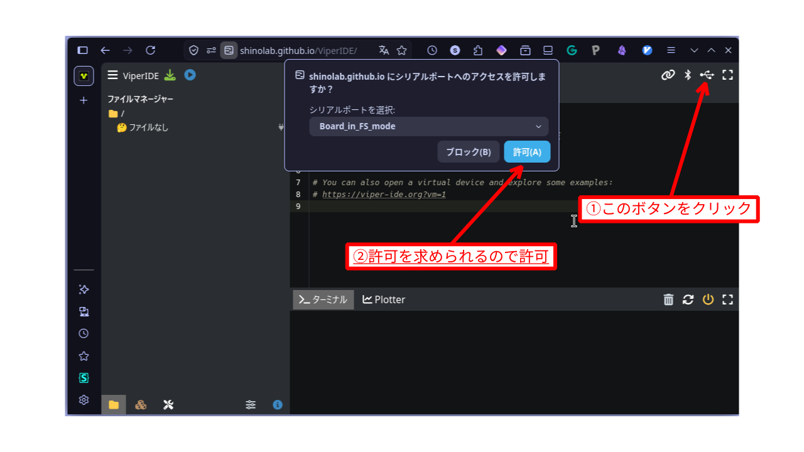
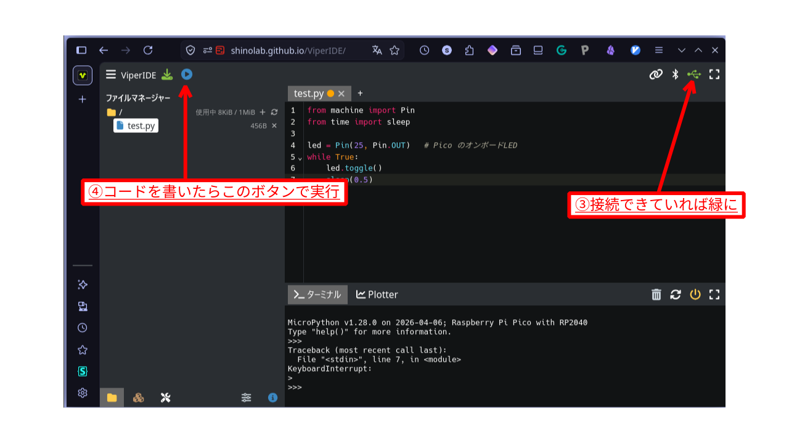
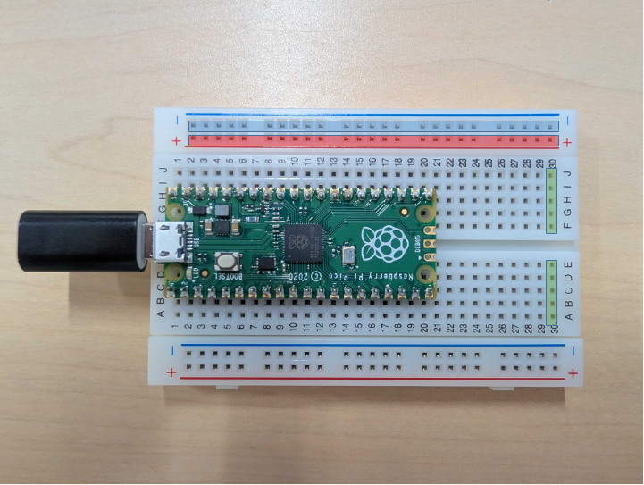
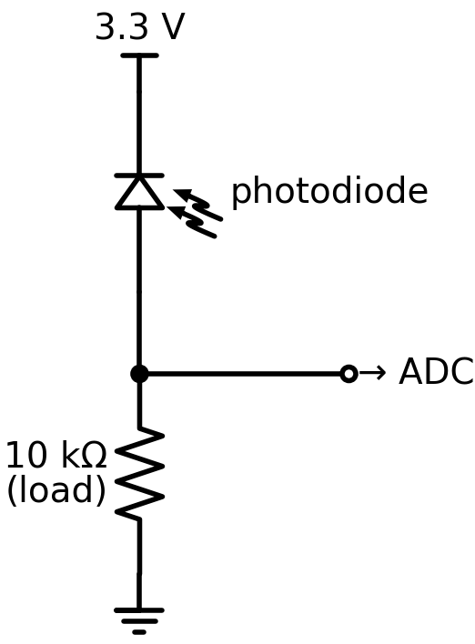
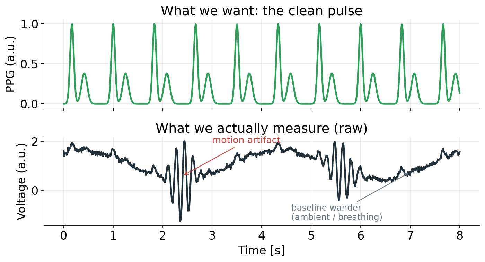
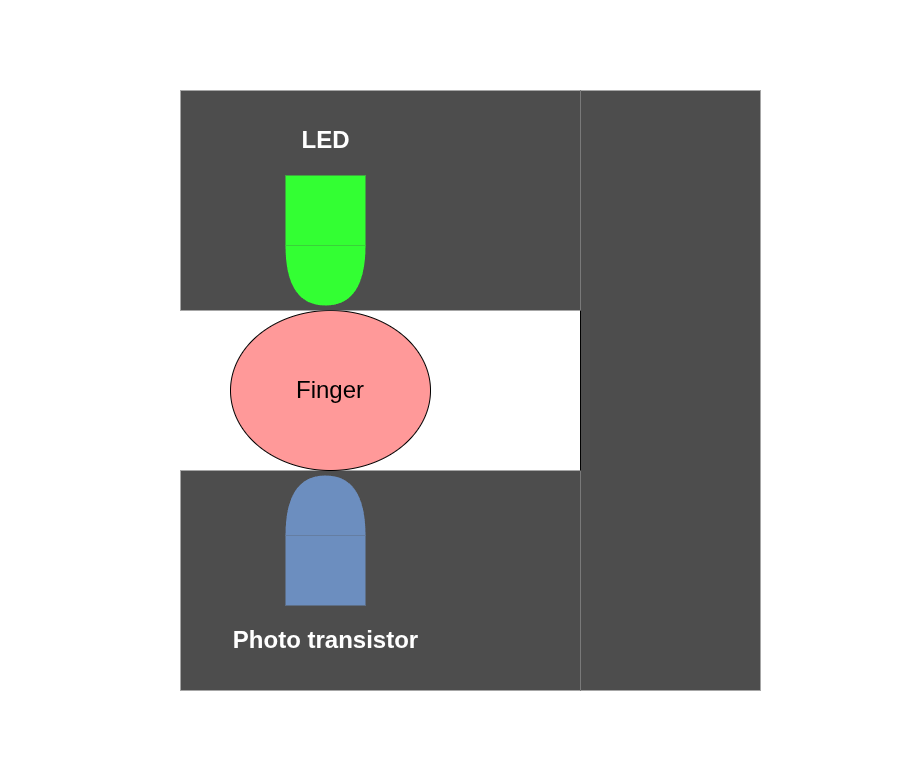
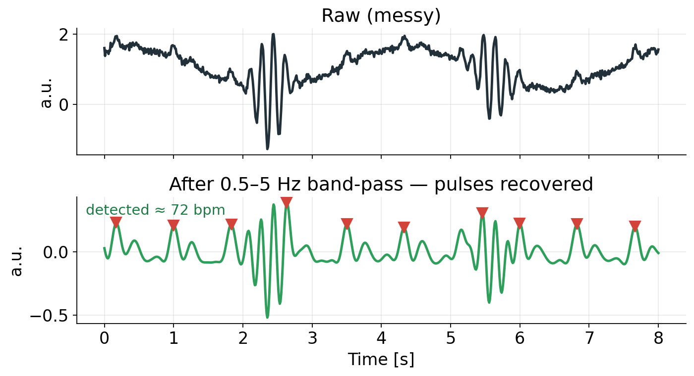
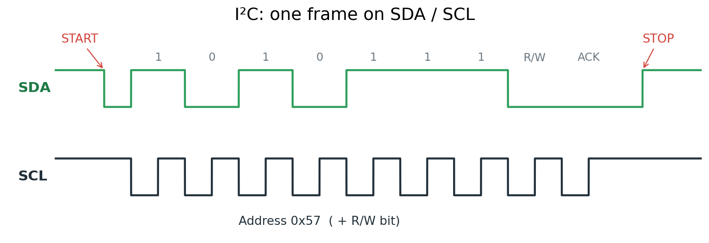

<!-- _class: lead -->
<!-- _paginate: false -->

# 複雑理工学実験概論

## 生体計測グループ (篠田・牧野) 第2回

担当: 特任助教 鈴木 颯

---

## 前回の振り返りと今日の内容

前回 (オンライン): PPGの原理, マイコン, ADC をシミュレータで扱った

今日 (対面): 実機の Pico で脈波を測る. シミュレータに無かった **ノイズ** に対処する

---

<!-- _class: lead -->

## 1

# 実機のセットアップ

---

## 実機セットアップ: MicroPython を焼く

まずはMicroPythonが実行できるようなファームウェアを書き込みましょう

1. MicroPythonのファームウェアファイル (**`uf2`** ファイル) をダウンロード
    - [https://micropython.org/download/RPI_PICO/](https://micropython.org/download/RPI_PICO/)
1. **BOOTSEL** ボタンを押しながら Pico を USB 接続
1. PCにUSBドライブ **RPI-RP2** が現れる
    - この時点でBOOTSELボタンは離してOK
1. **`.uf2`**を**RPI-RP2**に**ドラッグ＆ドロップ** or コピー
1. 自動で再起動 → MicroPython が起動

---

## ViperIDEとRaspberry Pi Picoの接続



- **ViperIDE**: ブラウザから **WebSerial** で実機に繋がげられるIDE 
  - [https://shinolab.github.io/ViperIDE/](https://shinolab.github.io/ViperIDE/)
  - ↑ プロッター機能を追加したカスタムバージョン

---

## ViperIDEとRaspberry Pi Picoの接続



- **ViperIDE**: ブラウザから **WebSerial** で実機に繋がげられるIDE 
  - [https://shinolab.github.io/ViperIDE/](https://shinolab.github.io/ViperIDE/)
  - ↑ プロッター機能を追加したカスタムバージョン

---

## ViperIDE で実機 Lチカ
 
```python
from machine import Pin
from time import sleep

led = Pin(25, Pin.OUT)   # Pico のオンボードLED
while True:
    led.toggle()
    sleep(0.5)
```

**やってみよう**: 接続 → `main.py` に貼り付け → ▶ → 実機LEDが点滅
- **実行**: コードを `main.py` に書く → ▶ で書き込み・実行
- **停止**: ■ で停止
- **出力**: `print` した値は下部のシリアル出力に出る
- **プロッタ**: 数値を`print` した場合に**リアルタイムにグラフ表示** (このコース用に追加した機能)

---

## 【余談①】なぜ書き込み方が2種類ある？

**そもそも Pico はどう起動する？**

- RP2040 チップには工場で焼かれた **ROMブートローダ** がある (書き換え不可)
- 電源ON時に「BOOTSELが押されている」なら
  → **USBマスストレージ** (`RPI-RP2` ドライブ)として自分を提示
- そこへ **`.uf2`** ファイルをコピーすると, ブートローダが(不揮発)フラッシュへ転送

---

## 【余談②】ファームウェア vs MicroPythonのコード

- **ファームウェア** ─ UF2で書き込んだのはMicroPython **インタプリタ本体** (BOOTSEL/マスストレージ経由)
    - BOOTSELを**押さず**に起動するとこのMicroPythonインタプリタが起動する
- **MicroPythonコード** ─ 起動後, MicroPythonファームウェアが **USBシリアル** を制御し **REPL** が動く. Pythonのコードは **シリアル経由** でPicoに渡されて実行される

---

<!-- _class: lead -->

## 2

# 自作回路で脈波を読む

---

## ブレッドボード: はんだ付けなしで配線



- 穴に部品を挿すだけで回路を組める基板
- **縦の5穴** (同一数値) が内部でつながっている
- 上下の**電源レール**は横方向に1列つながってる

> 同じ列に挿した足はつながる. 別の点にしたいときは列をずらす

---

## ディスクリートLEDを使ったLチカ


**やってみよう**: LEDと抵抗を配線してLEDを点滅させる
- 注意点:
  - 抵抗は「赤・茶・茶・金」色 (220Ω) のを使う
  - LEDは後のことを考えて写真のあたりに置くと良い
  - 部品の足は好きに曲げてOk
  - 無理に部品の足だけで配線しようとすると面倒なのでジャンパワイヤを適宜使う

---

## フォトダイオード



- **フォトダイオード**: 光が当たると電流が流れる素子
- 負荷抵抗で **電流 → 電圧** に変換し, ADC で読む

正確には皆さんの手元にあるのはフォトトランジスタ
- フォトトランジスタ=フォトダイオード+トランジスタ

---

## やってみよう: 環境光が検知できるかをみる 


1. フォトトランジスタと抵抗 (10kΩ)をブレッドボードに配線
    - LEDの配線は残したままOK
1. ADC で読んで `print`
1. フォトトランジスタを手で覆う, スマホのライトを当てるなどして値の変化をみる

```python
from machine import ADC, Pin

sensor = ADC(Pin(26))
while True:
    v = sensor.read_u16()
    print(v)
```

---

## LEDとフォトトランジスタを組み合わせて脈拍を見る

LEDとフォトトランジスタを並べて配置し, その間に指を入れてプロッタで脈拍が見れるか確認してみよう

---

<!-- _class: lead -->

## 3

# ノイズへの対処

---

## 生の信号にはノイズが多い



実測の波形には脈以外の成分が乗る: 

- **環境光のドリフト** (太陽・蛍光灯・呼吸性変動)
- **体動アーチファクト** (指や手の動き)
- **電気的雑音**

> 必要な脈波成分は, この中のごく一部

---

## 信号を取り出すには?



1. **環境光を抑える** ─ 手で覆う／遮光テープ／部屋を暗く
1. **LEDを固定** ─ 指を挟み, 光路を安定させ SN を上げる
1. **信号を増幅** ─ オペアンプでAC成分を増幅
1. **ソフト処理** ─ フィルタで脈を抽出 (次スライド)

> ハード対策 (光学・回路) と ソフト対策 (信号処理) の両方を使う

---

## ソフトウェアでの対処: フィルタ



- 脈拍は約 **1〜2 Hz**
- **0.5〜5 Hz のバンドパス** で低周波と高周波を除去
- 残った波形の **ピーク検出 → 心拍数**

> 体動は脈と周波数が近く, フィルタだけでは消えない

---

## とはいえ...

第1回で触れたとおり, **AC は DC の 1% 以下**

- もともとのADCの精度などもあって, 上記のような対策を行っても脈拍を見るのは結構きつい
  - オペアンプの回路をちゃんと組めばできるかも

> 製品はこれをどう実現している?

---

<!-- _class: lead -->

## 4

# 専用IC: MAX30100/MAX30102

---

## MAX30102: PPG用の専用センサIC


1チップに統合されているもの: 

- 赤・赤外 **LED**
- **フォトダイオード** (受光)
- **アナログフィルタ+高精度ADC**
- **デジタルフィルタ**
- **I2C** 通信インタフェース

> 諸々のノイズ対策が, この1チップに入っている
> 一個$1くらいで売ってる 

---

## 動かしてみる (ライブラリ利用)

[n-elia/MAX30102-MicroPython-driver](https://github.com/n-elia/MAX30102-MicroPython-driver)
- インストールは手動でお願いします...

```python
from machine import I2C, Pin
from max30102 import MAX30102, MAX30105_PULSE_AMP_MEDIUM

i2c = I2C(sda=Pin(0), scl=Pin(1), freq=400000)

sensor = MAX30102(i2c=i2c)

sensor.setup_sensor()

sensor.set_sample_rate(400)
sensor.set_fifo_average(8)
sensor.set_active_leds_amplitude(MAX30105_PULSE_AMP_MEDIUM)

while True:
    sensor.check()
    while sensor.available():
        red_reading = sensor.pop_red_from_storage()
        print(red_reading)
```

---

## I2C ってなに？



- **2本の線**で複数デバイスと通信するシリアルバス
  - **SDA** (データ)・**SCL** (クロック)
- 各デバイスは **アドレス** を持つ (MAX30102 = **0x57**)
- マスタ (Pico) がアドレスを指定して会話

> 配線2本で, 何個ものセンサを数珠つなぎにできる

### I2Cの波形
  - **START** (SCL=H のまま SDA↓)→ アドレス7bit + R/W → **ACK** → データ → **STOP** (SCL=H のまま SDA↑)

---

## 現代的な組み込み開発

(少なくとも趣味のレベルで) アナログディスクリート部品を組み合わせて何かを作ることはほとんどないと思う

大抵の場合は専用ICがあり, それとI2C等でデジタル通信することでデータが得られるようになっている

---

## 【深掘り③】MicroPython はプロトに強い. でも…

**長所**: REPL で対話的, 反復が速い → **プロトタイピングに向く**

**製品で効いてくる制約**: 

- **メモリ** ─ インタプリタ＋バイトコードでRAM/Flash消費大
   (RP2040 の RAM は 264 KB)
- **速度・決定性** ─ バイトコード実行＋GC → 高速サンプリングや厳密なリアルタイムに不利
- **消費電力** ─ 電池駆動に不利

---

## だから C / Rust でネイティブに

製品ファームは **コンパイルして** 載せる: 

| | MicroPython | C / Rust |
|---|---|---|
| 開発速度 | ◎ 速い・対話的 | △ ビルド要 |
| 実行効率 | △ 遅い | ◎ ネイティブ速度 |
| メモリ/電力 | △ 多い | ◎ 小さい・省電力 |
| リアルタイム性 | △ GC停止 | ◎ 決定的 |

- **C/C++**: Pico SDK (公式)　**Rust**: embassy-rs (型安全・モダン)

---

## 生体計測の難しさと, 製品の工夫

スマートウォッチ等が実際にやっていること: 

- **光学**: 緑LED＋複数受光素子, 密着設計で環境光を遮る
- **体動補正**: 加速度センサを併用し, 動きの成分を補正
- **アルゴリズム**: 適応フィルタ・機械学習で脈を推定
- **校正と低電力設計**: 個人差対応, 間欠測定でバッテリを持たせる

---

<!-- _class: lead -->

## 6

# まとめ

---

## 2回のまとめ

- **① トランスデュース** ── 光 → 電気 (PPG)
- **② 微弱信号への対処** ── 環境光・体動を光学・回路・フィルタで抑える
- **③ アナログ → デジタル** ── ADC, そしてI2Cで専用ICと通信

---

<!-- _class: lead -->

# おつかれさまでした

質問・実験の続きはいつでも

